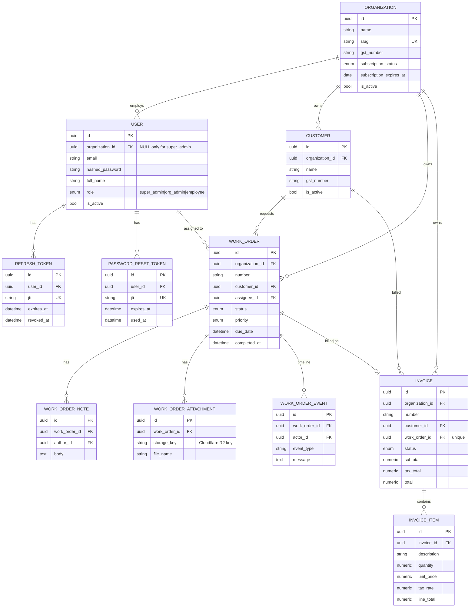

# Elangovan Associates — Entity-Relationship Design

This is the **full data model** for the platform. Phase 1 implements the schema
in its entirety (one coherent initial migration) and the auth-related tables are
used immediately; the remaining tables are populated by later phases.

## ER Diagram



## Design decisions

1. **UUID primary keys (`gen_random_uuid()`).** Tenant data should not expose
   sequential, guessable IDs in URLs. UUIDs are generated server-side by
   Postgres so the app never has to round-trip to get an ID.

2. **`organization_id` on every tenant-owned table.** This single column is the
   tenancy boundary. Every query in tenant-scoped features filters on it (see
   the multi-tenancy section below). It is indexed on each table because it
   appears in the `WHERE` clause of essentially every read.

3. **Super admin modeled as a `User` with `organization_id = NULL`.** Rather than
   a separate table, the super admin is a role on the unified user table. A
   **CHECK constraint** (`ck_users_org_role_consistency`) guarantees the
   invariant *"super_admin ⇔ org is NULL; any other role ⇔ org is NOT NULL"* at
   the database level, so bad rows are impossible even via raw SQL.

4. **Email uniqueness.** Unique **per organization** (`uq_users_org_email`) so two
   different tenants can each have `admin@…`. Because that composite constraint
   can't enforce uniqueness across `NULL` orgs, a **partial unique index**
   (`uq_users_email_superadmin … WHERE organization_id IS NULL`) keeps super-admin
   emails globally unique.

5. **Server-side token tables.** JWTs are stateless, but refresh and
   password-reset tokens are persisted (keyed by `jti`) so they can be **revoked**
   — logout, refresh rotation, and "log out everywhere on password change" all
   depend on this.

6. **Money as `NUMERIC(12,2)`**, never floating point — avoids rounding drift on
   invoice totals and GST.

7. **Immutable work-order timeline (`WORK_ORDER_EVENT`).** Status changes,
   assignments, and completion are appended as events, giving an auditable
   history rather than overwriting fields.

8. **Cascade rules chosen per relationship.**
   - Deleting an organization cascades to all its data (`ON DELETE CASCADE`).
   - A customer referenced by a work order/invoice is **`RESTRICT`**ed from
     deletion (financial records must keep their customer).
   - Unassigning happens via **`SET NULL`** (e.g. deleting a user nulls their
     work-order assignments rather than deleting the orders).

## Multi-tenancy enforcement

- **Column:** `organization_id` on `users`, `customers`, `work_orders`,
  `invoices` (and transitively their children).
- **Request context:** `get_current_tenant` (in `app/core/dependencies.py`)
  derives the caller's `organization_id` from their authenticated user — it is
  **never** taken from the request body or query string, so a client cannot ask
  for another tenant's data.
- **Query layer:** tenant-scoped repositories (added per feature from Phase 2)
  always inject `WHERE organization_id = :current_org`, and writes stamp the
  caller's org id. Super admins are explicitly rejected from tenant-data
  endpoints (they operate on the organization registry instead).
```
